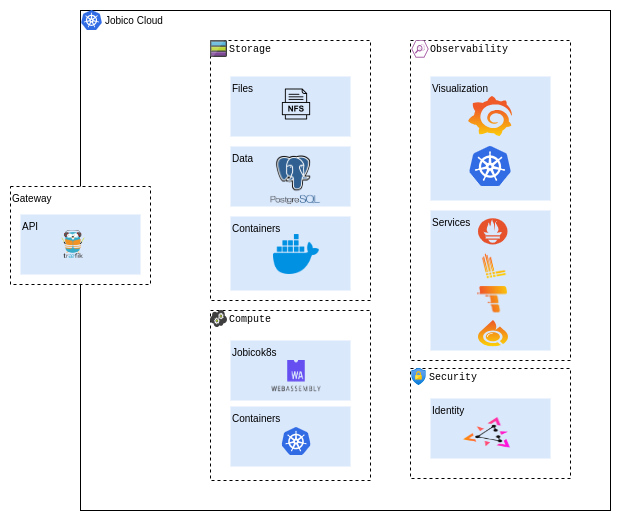

# Introduction

This educational project started as a set of scripts to automate the process described in [Kubernetes the Hard Way](https://github.com/kelseyhightower/kubernetes-the-hard-way). Over time, it has evolved into a broader initiative that supports various  cluster topologies and integrates several Kubernetes extensions as addons. Despite these enhancements, the project remains an educational tool to deepen my understanding of technologies such as Kubernetes, its high availability configurations, Bash scripting, and Linux.

For details on the project's implementation, check [IMPLEMENTATION.md](/IMPLEMENTATION.md).

# Overview

The following sections outline the various topologies that the tool can create, based on the parameters specified by command line or as a YAML file. 

## Single Control Plane Configuration


In this setup, there is one dedicated control plane server managing one or more worker nodes, offering a straightforward configuration often used in small-scale deployments.

## High Availability Configuration


This topology features multiple control plane servers and one or more worker nodes, designed to ensure redundancy and fault tolerance in production environments. It leverages **HAProxy** and **Keepalived** to implement a highly available **load balancer** setup.

### Single Node Configuration


This topology involves a single server that fulfills both the control plane and worker node roles, providing a basic setup typically used for learning and testing purposes.

# Kubernetes Cluster 

## Architecture



## Extensions

Extensions are additional components installed in a cluster to enhance its capabilities. These enhancements include tools and features such as observability solutions for monitoring and logging, database management systems, metrics collection and analysis, container registries, and more.

### Add-Ons & Services

**Add-ons** and **Services** are part of a basic mechanism for managing dependencies among extensions within a cluster. **Core** add-ons have no dependencies other than Kubernetes itself, while **Extra** add-ons depend on the core add-ons. Service components are installed after the cluster is created and all Pods are in the "Ready" state. **Core** services have no dependencies, whereas **Extra** services depend on the Core services.

### Enhacements list

- [CoreDNS](https://coredns.io/plugins/kubernetes): It provides cluster wide DNS services.
- [k8s_gateway](https://github.com/ori-edge/k8s_gateway): This component acts as a single external DNS interface into the cluster. It supports Ingress, Service of type LoadBalancer and resources from the Gateway API project.    
- [Metallb](https://metallb.universe.tf/): A network load balancer implementation. The pool of IP address can be configured here: /addons/core/metallb
- [NFS](https://github.com/kubernetes-csi/csi-driver-nfs): This driver allows Kubernetes to access NFS server on Linux node.
- [Traefik](https://traefik.io/traefik/): The Traefik Kubernetes Ingress provider is a Kubernetes Ingress controller. It manages access to cluster services by supporting the Ingress specification.
- [Metrics](https://github.com/kubernetes-sigs/metrics-server): It collects resource metrics from Kubelets and exposes them in Kubernetes apiserver through Metrics API for use by Horizontal Pod Autoscaler and Vertical Pod Autoscaler. It can also be accessed by kubectl top.
- [Distribution Registry](https://distribution.github.io/distribution/): It is a server side application that stores and lets you distribute container images and other content. 
- [Observability](https://github.com/prometheus-operator/kube-prometheus): It installs and integrates the following services:

  - **The Kube-Prometheus stack**
  - **Grafana Loki**
  - **Grafana Tempo**
  - **Grafana Pyroscope**
  - **Prometheus Postgres Exporter**

  In addition, it provisions the following dashboards:
  - **JVM-micrometer**: A dashboard that presents a collection of metrics collected from services running on a Java Virtual Machine.
  - **Trace**: This dashboard displays information from Loki(logs), Tempo(traces), and Prometheus(metrics) correlated by a Trace ID and associated to a service call. 
  - **Pg**: It displays the information collected by the **Prometheus Postgres Exporter**.
  
- [Dashboard](https://github.com/kubernetes/dashboard): A general purpose, web-based UI for Kubernetes clusters. It allows to manage applications running in the cluster.
- [CloudNativePG](https://github.com/cloudnative-pg/cloudnative-pg): CloudNativePG is an operator that covers the full lifecycle of a highly available PostgreSQL database cluster with a primary/standby architecture, using native streaming replication.
- [ZITADEL](https://github.com/zitadel/zitadel): Identity management service that implements several standards like OpenID Connect and SAML.

### Disabling Enhacements

To omit the deployment of an extension, when a cluster is built using command line, create a file named **disabled** in its directory. This simple step ensures that the specified extension(add-on or service) will not be deployed, allowing you to customize the cluster setup according to your needs.

## Jobico.org

### DNS

The cluster deploys CoreDNS for internal DNS resolution and [k8s_gateway](https://github.com/ori-edge/k8s_gateway) for external DNS resolution. It designates **jobico.org** as the primary domain for all subdomains corresponding to services that expose functionality externally.
On local machines, you can configure the DNS server at **192.168.122.23** to handle all domains within jobico.org. One method to achieve this is by implementing Split DNS. Numerous tutorials are available [online](https://www.google.com/search?q=split+dns+linux) that can guide you through this setup.

### Certificate

A common certificate for all services exposed in **jobico.org** is generated and signed by the cluster's CA. After creating the cluster, you can install the cluster's CA on Linux by running the script **hacks/cert_add.sh**.

## Management

### Creation

Before proceeding with the cluster creation, install the dependencies described in the section [Prerequisites](#prerequisites) and generate the **cloud-init cfg** files by running:

```bash
$ ./cluster.sh cfg
```

After the cluster is created, you can configure Split DNS to access services using the **jobico.org** domain, [more info](#dns).


#### From command line

```bash
# Cluster without worker nodes and one control plane server.
./cluster.sh new --nodes 0

# Cluster with two worker nodes and one control plane server.
./cluster.sh new

# Cluster with two worker nodes and one control plane server that can be also schedulable.
./cluster.sh new --schedulable-server

# HA Cluster with three worker nodes, two control plane servers and two load balancer.
./cluster.sh new --nodes 3 --cpl 2

# HA Cluster with ten worker nodes, five control plane servers and three load balancers.
./cluster.sh new --nodes 10 --cpl 5 --lb 3

# HA Cluster with three worker nodes, two control plane servers and one load balancer. 
# After the construction is completed (all pods Ready), it installs the scripts in the 
# /services directory.
./cluster.sh new --nodes 3 --cpl 2 --services
```

For more information, check [The cluster.sh commands reference](#clustersh-command-reference)

#### Using a YAML file

The cluster description can also be specified in a YAML file to facilitate automation scripts:

```bash
./cluster.sh yaml [FILE NAME]
```

##### Schema

```yaml
cluster:
  node:
    size: [NUMBER OF WORKER NODES]
  cpl:
    schedulable: [true if the server is tainted.]
    size: 0
  addons:
    - dir: [Subdirectory of addons]
      list:
      [List of addons]
  services:
    - dir: [Subdirectory of services]
      list:
      [List of services]
```
#### Examples

- One control plane and worker node server with several addons and services.

```yaml
cluster:
  node:
    size: 3
  cpl:
    schedulable: true
  addons:
    - dir: core
      list:
        - lb
        - dns
        - storage
    - dir: extras
      list:
        - registry
        - database
  services:
    - dir: core
      list:
        - database
    - dir: extras
      list:
        - identity
```

- High availability configuration with 5 worker nodes, 3 control plane servers and two load balancers.

```yaml
cluster:
  node:
    size: 5
  cpl:
    schedulable: false
    size: 3
    lb:
      size: 2
  addons:
    - dir: core
      list:
        - lb
        - dns
        - storage
    - dir: extras
      list:
        - registry
        - database
  services:
    - dir: core
      list:
        - database
    - dir: extras
      list:
        - identity
```

##### Running examples

- One node
```bash
/cluster.sh yaml examples/basic/cluster.yaml 
```
- High availability
```bash
./cluster.sh yaml examples/ha/cluster.yaml
```

### Add nodes

After creating a cluster, you can add extra nodes by running the following command:

```bash
./cluster.sh add [NUMBER OF WORKER NODES]
```

For example:

```bash
# Adds 1 worker node
./cluster.sh add

# Adds 5 worker node
./cluster.sh add 5
```

### Managing VMs

```bash
# Starts the cluster's VMs.
./cluster.sh start
# Shutdown the cluster's VMs.
./cluster.sh shutdown
# Suspend the cluster's VMs.
./cluster.sh suspend
# Resume from suspension the cluster's VMs.
./cluster.sh resume
# List the cluster's VMs.
./cluster.sh list
```
### Destroying the cluster

The following command stops and deletes the VMs that form a cluster:

```bash
./cluster.sh destroy
```


# Cluster.sh command reference

```
Usage: 
       ./cluster.sh <command> [arguments]
Commands:
          help
          new
          add
          destroy
          addons
          start
          shutdown
          suspend
          resume
          info
          state
          list
          local
          kvm
          cfg
          debug

Additional help: ./cluster.sh help <command>
```
```
Usage: ./cluster.sh new [arguments]
Create the VMs and deploys Kubernetes cluster into them.
The arguments that define how the cluster will be created:
     --nodes n
            Specify the number of worker nodes to be created. The default value is 2. 
     --cpl n
            Specify the number of control planed nodes to be created. The default value is 1. 
     --lb n
            Specify the number of load balancers to be created in case --cpl is greater than 1. The default value is 2. 
     --addons dir_name
            Specify a different directory name for the addons. Default: ./addons
     --no-addons
            Skip the instalation of addons
     --services
            Waits for the cluster to be created and then runs the scripts on the services directory.
     --schedulable-server
            The control plane nodes will be available to schedule pods. The default is false(tainted).
     --dry-run
            Create the dabases, kubeconfigs, and certificates but does not create the actual cluster. This option is useful for debugging.
     --debug [ s | d ]
            Enable the debug mode.
       s: displays basic information.
       d: display advanced information.
```
```
Usage: ./cluster.sh add [arguments]
Add new nodes to the current Kubernetes cluster.
The arguments that define how the cluster will be updated:
     --nodes n
            Specify the number of worker nodes to be added. The default value is 1. 
     --dry-run
            Update the dabases, kubeconfigs, and certificates but does not create the actual cluster. This option is useful for debugging.
     --debug [ s | d ]
            Enable the debug mode.
       s: displays basic information.
       d: display advanced information.
```
```
Usage: ./cluster.sh destroy
Destroy the Kubernetes cluster and the VMs
```
```
Usage: ./cluster.sh addons [dir]
Install the addons from the folder ./addons or the one passed as argument.
```
```
Usage: ./cluster.sh cfg
Create the cloud init cfg files.
```
```
Usage: ./cluster.sh debug
Prints the content of the internal databases using the dao scripts.
```
```
Usage: ./cluster.sh <info|state|list>
Display information about the cluster's VM(s).
```
```
Usage: ./cluster.sh kvm
Install kvm and its dependencies locally.
```
```
Usage: ./cluster.sh <info|state|list>
Display information about the cluster's VM(s).
```
```
Usage: ./cluster.sh local
Prepares the local enviroment. It creates the kubeconfig and installs kubectl.
```
```
Usage: ./cluster.sh start
Starts the cluster's VMs
```
```
Usage: ./cluster.sh <info|state|list>
Display information about the cluster's VM(s).
```
# Prerequisites

The following packages must be installed locally before creating a cluster::

- SSH
- OpenSSL
- [Cloud-init](https://cloud-init.io/)
- [KVM](https://ubuntu.com/blog/kvm-hyphervisor).
- [Helm](https://helm.sh/): Several add-ons are installed using Helm charts.
- [dnsmasq-utils](https://packages.debian.org/buster/dnsmasq-utils)

This script [deps.sh](https://github.com/andrescosta/jobico-cloud/hacks/deps.sh) can facilitate the installation of these dependencies (except Helm).

# Possible future areas of work

- Add more capabalities configured by YAML (CIDRs, main domain, etc.)
- Improvements to the observavility stack
- Improvements to the plugins mechanism
- Imporvements to the templating system.
- Performance
- Cloud-Init
- TLS updates using Let's Encrypt
- Control Plane Kubelet
- Kubeadm
- External Etcd